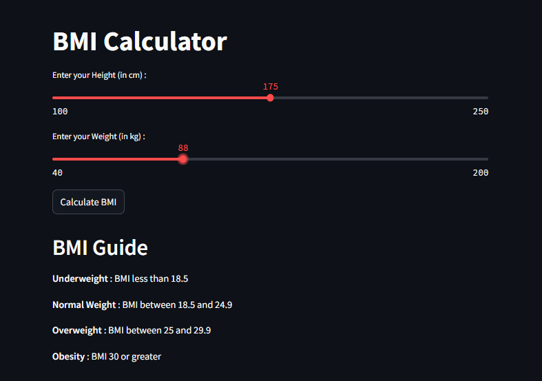
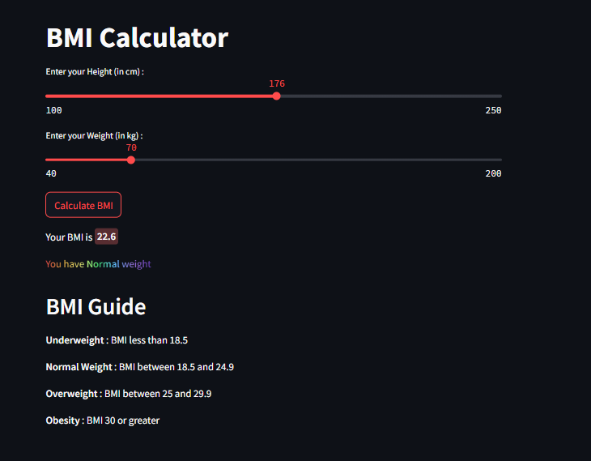

# BMI Calculator 🏋️‍♀️💪

Welcome to the **BMI Calculator**! This is a simple web application built using **Streamlit** that helps you calculate your **Body Mass Index (BMI)** based on your height and weight. It's fast, interactive, and fun to use! 🌟

### How It Works ⚙️

1. **Enter Your Details** 📏📊:
   - Use the sliders to input your **height** (in cm) and **weight** (in kg).

2. **Calculate Your BMI** 🧮:
   - After entering your details, click the **"Calculate BMI"** button to instantly calculate and display your BMI.

3. **Instant Feedback** 🔍:
   - Based on your BMI, you will receive a color-coded message:
     - **Underweight**: Blue text for BMI less than 18.5.
     - **Normal Weight**: Rainbow-colored text for BMI between 18.5 and 24.9 🌈.
     - **Overweight**: Green text for BMI between 25 and 29.9 🍏.
     - **Obesity**: Red text for BMI 30 or greater 🚨.

4. **Fun Celebration 🎉**:
   - If your BMI falls into the **Normal Weight** range, you'll see **balloons** 🎈 floating around as a fun celebration!

---

### BMI Categories 📚

- **Underweight**: BMI less than 18.5
- **Normal Weight**: BMI between 18.5 and 24.9
- **Overweight**: BMI between 25 and 29.9
- **Obesity**: BMI 30 or greater

---

### Features ✨

- **Interactive Sliders**: Easily adjust your height and weight to see how your BMI changes.
- **Instant Calculation**: Your BMI will be calculated instantly with color-coded results.
- **Color-Coded Feedback**: Get clear feedback on your BMI category with fun colors:
  - Blue for Underweight
  - Rainbow for Normal Weight 🌈
  - Green for Overweight 🍏
  - Red for Obesity 🚨
- **Balloons 🎈**: Celebrate your healthy BMI with some fun balloons if you're in the **Normal Weight** range.
- **Helpful Guide**: Below the calculator, you'll find a guide explaining the different BMI categories and what they mean for your health.

---

### Visuals 🎆
- Here are the snaps from our web! 

